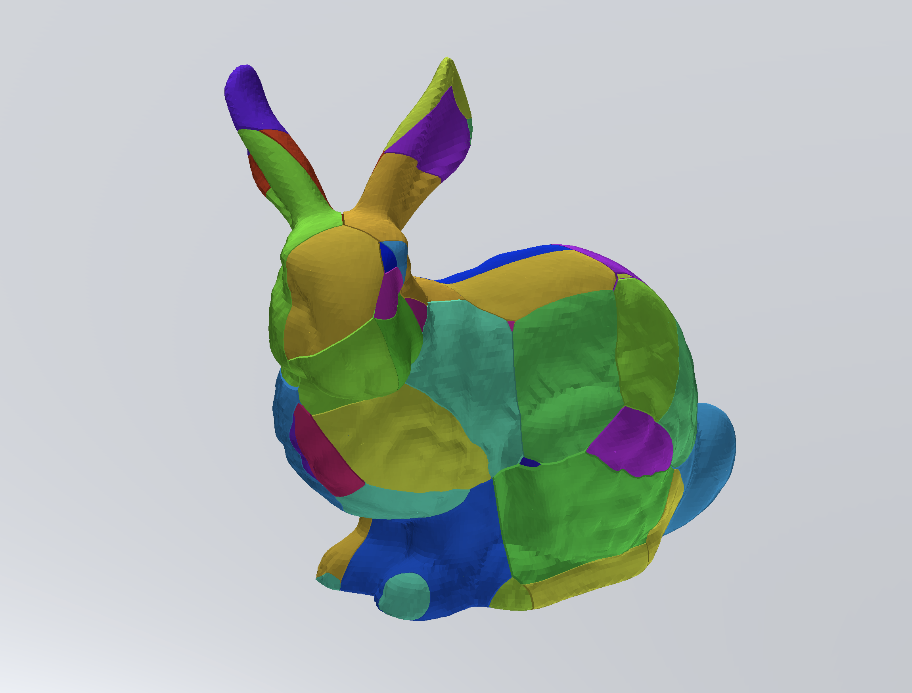

# unity-voronoi-csg
- Delauney diagram module (2D/3D) with bistellar flip algolithm.
- Voronoi diagram module (2D/3D) from delauney triangles above.
- CSG(Constructive Solid Geometry) for an atbitrary mesh.

## Usage

using a [simplex geom submodule](https://github.com/komietty/unity-simplex-geometry), so update submodule first.

## reference

http://www.gdmc.nl/publications/2007/Computing_3D_Voronoi_Diagram.pdf
