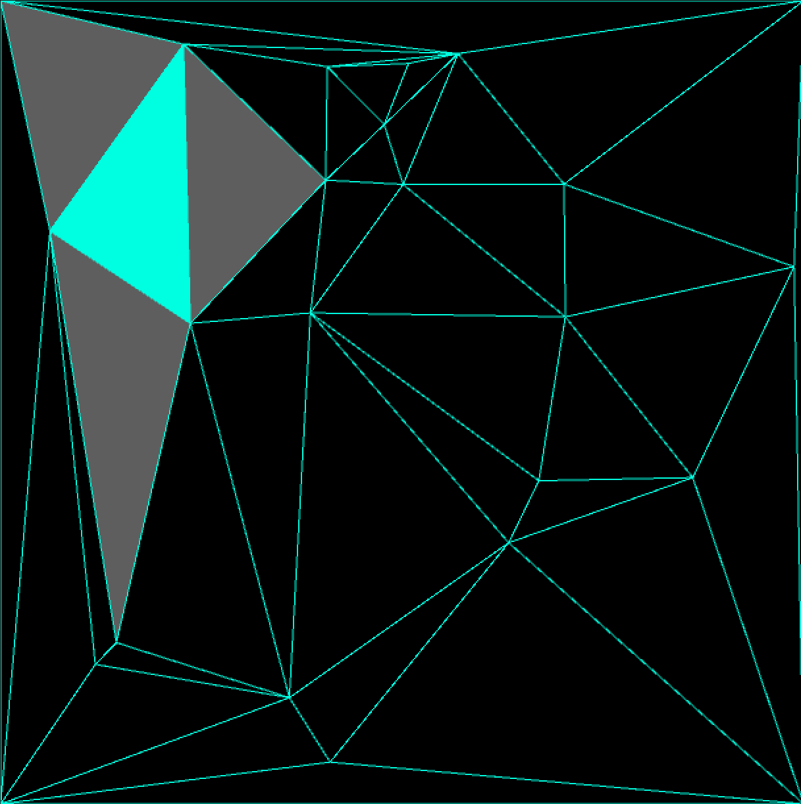

# unity-drauney-triangulation
2D and 3D drauney triangulation module with bistellar flip method.  
3D version does not works but could be not resolved. Please PR me if you could solve errors.

## Usage

using a [simplex geom submodule](https://github.com/komietty/unity-simplex-geometry), so update submodule first.

## Compatibility

Tested on Unity 2019.3.11f1, windows10 (RTX 2080 max-q).

## reference

http://www.gdmc.nl/publications/2007/Computing_3D_Voronoi_Diagram.pdf
# unity-drauney-triangulation
