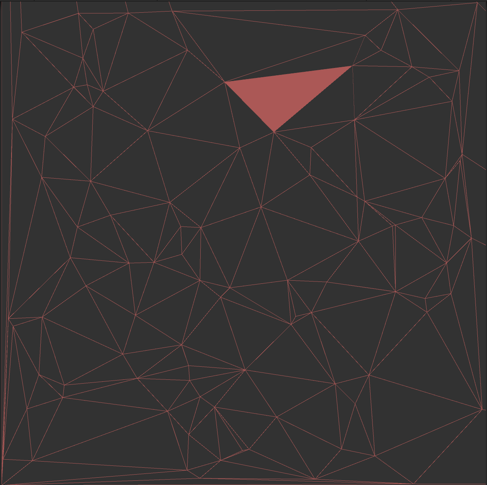
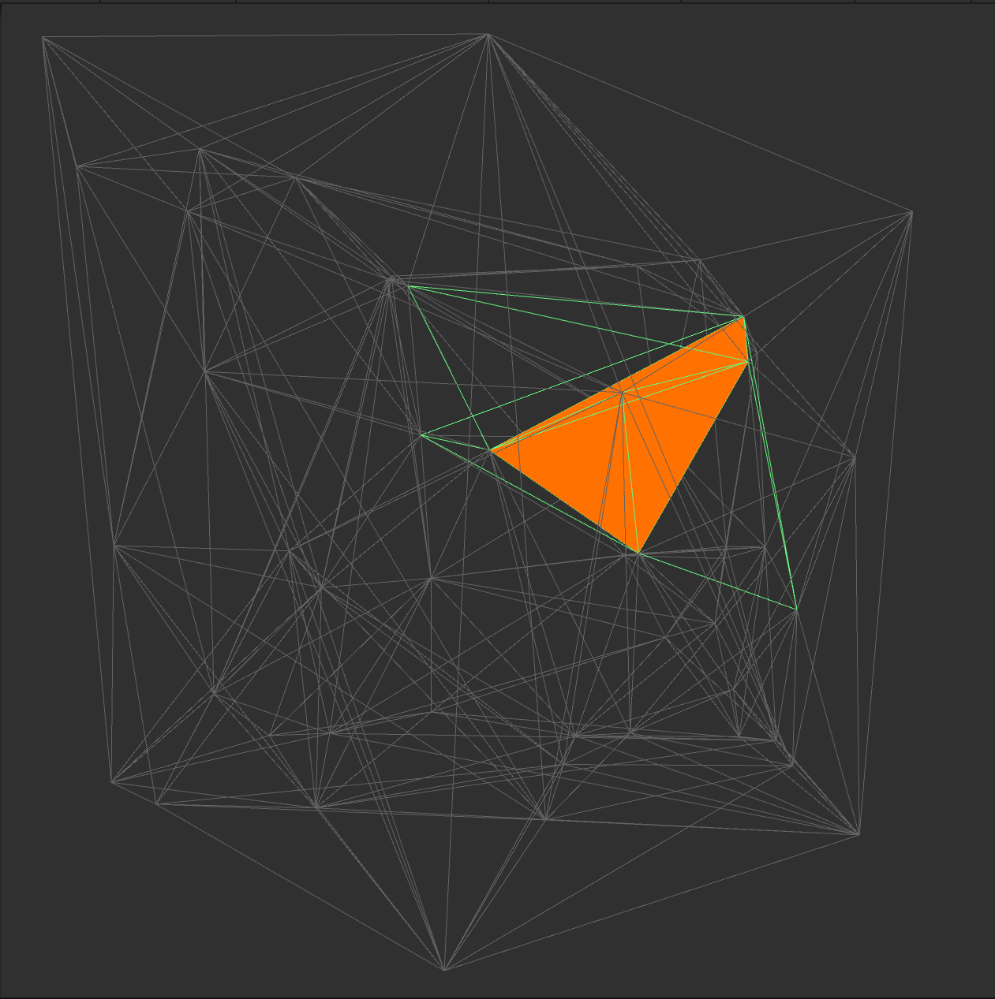

# unity-drauney-triangulation
2D and 3D drauney triangulation module with bistellar flip method.

With this easily created Volonoi diagram.

### 2D version

### 3D version

## Usage

using a [simplex geom submodule](https://github.com/komietty/unity-simplex-geometry), so update submodule first.

## reference

http://www.gdmc.nl/publications/2007/Computing_3D_Voronoi_Diagram.pdf
